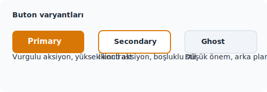
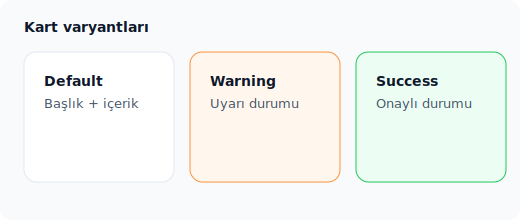

# Design System Kılavuzu

Bu doküman; renk/token tanımları, tipografi ölçekleri, temel bileşen örnekleri ve yeni bileşen eklerken takip edilecek kontrol listesini içerir. Storybook benzeri örnekler için kod snippet’leri ve görseller eklendi.

## Tasarım Token’ları

### Renk Paleti
| Token | Değer | Kullanım |
| --- | --- | --- |
| `--color-primary` | `#d97706` | CTA butonları, ana vurgu yüzeyleri |
| `--color-primary-contrast` | `#0f172a` | Açık zeminlerde okunabilir kontrast |
| `--color-surface` | `#ffffff` | Kartlar, modal ve form yüzeyleri |
| `--color-surface-muted` | `#f8fafc` | Bölüm arka planları, ikincil yüzeyler |
| `--color-border` | `#e2e8f0` | Kart/fieldset sınırları |
| `--color-success` | `#22c55e` | Onay, başarılı durumlar |
| `--color-warning` | `#fb923c` | Uyarı, bekleyen durumlar |
| `--color-text` | `#0f172a` | Genel metin rengi |

```css
:root {
  --color-primary: #d97706;
  --color-primary-contrast: #0f172a;
  --color-surface: #ffffff;
  --color-surface-muted: #f8fafc;
  --color-border: #e2e8f0;
  --color-success: #22c55e;
  --color-warning: #fb923c;
  --color-text: #0f172a;
}
```

### Spacing & Ölçekler
| Token | Değer | Açıklama |
| --- | --- | --- |
| `--space-2` | `8px` | Sıkı boşluk, ikon ile metin arası |
| `--space-3` | `12px` | Etiket/pil boşlukları |
| `--space-4` | `16px` | Standart yatay padding |
| `--space-6` | `24px` | Kart iç boşluğu |
| `--radius-md` | `12px` | Kart ve form kontrolleri |
| `--radius-lg` | `20px` | Modal, panel |
| `--shadow-sm` | `0 4px 12px rgba(15, 23, 42, 0.08)` | Hafif gölge |
| `--shadow-lg` | `0 12px 36px rgba(15, 23, 42, 0.16)` | Yoğun gölge |

### Tipografi Token’ları
| Token | Ağırlık | Boyut / Satır Aralığı | Kullanım |
| --- | --- | --- | --- |
| `--font-family` | `Inter, 'SF Pro', Arial` |  | Varsayılan font ailesi |
| `--text-display` | 700 | `32px / 40px` | Sayfa başlıkları |
| `--text-title` | 600 | `24px / 32px` | Bölüm başlıkları |
| `--text-subtitle` | 500 | `18px / 26px` | Kart başlığı, form heading |
| `--text-body` | 400 | `16px / 24px` | Paragraf |
| `--text-caption` | 500 | `13px / 18px` | Yardımcı metin, rozet |

```css
:root {
  --font-family: 'Inter', 'SF Pro', Arial, sans-serif;
  --text-display: 32px/40px 700;
  --text-title: 24px/32px 600;
  --text-subtitle: 18px/26px 500;
  --text-body: 16px/24px 400;
  --text-caption: 13px/18px 500;
}

h1 { font: var(--text-display); color: var(--color-text); }
h2 { font: var(--text-title); color: var(--color-text); }
.body { font: var(--text-body); }
.caption { font: var(--text-caption); color: #475569; }
```

## Bileşen Örnekleri

### Button


```tsx
// Button.tsx
import clsx from 'clsx';

type ButtonProps = {
  variant?: 'primary' | 'secondary' | 'ghost';
  children: React.ReactNode;
} & React.ButtonHTMLAttributes<HTMLButtonElement>;

export function Button({ variant = 'primary', children, className, ...rest }: ButtonProps) {
  const base = 'inline-flex items-center justify-center rounded-[var(--radius-md)] px-[var(--space-4)] py-3 font-semibold transition';
  const variants = {
    primary: 'bg-[var(--color-primary)] text-white shadow-[var(--shadow-sm)] hover:brightness-110',
    secondary: 'border-2 border-[var(--color-primary)] text-[var(--color-primary-contrast)] bg-white hover:bg-[var(--color-surface-muted)]',
    ghost: 'text-[var(--color-text)] bg-[var(--color-surface-muted)] border border-[var(--color-border)] hover:border-[var(--color-primary)]',
  } as const;

  return (
    <button className={clsx(base, variants[variant], className)} {...rest}>
      {children}
    </button>
  );
}
```

**Story örneği**
```tsx
// Button.stories.tsx
import type { Meta, StoryObj } from '@storybook/react';
import { Button } from './Button';

const meta: Meta<typeof Button> = {
  title: 'Components/Button',
  component: Button,
};
export default meta;

type Story = StoryObj<typeof Button>;

export const Primary: Story = { args: { children: 'Devam et', variant: 'primary' } };
export const Secondary: Story = { args: { children: 'Daha sonra', variant: 'secondary' } };
export const Ghost: Story = { args: { children: 'Metin linki', variant: 'ghost' } };
```

### Card


```tsx
// Card.tsx
import clsx from 'clsx';

type CardProps = {
  tone?: 'default' | 'success' | 'warning';
  title: string;
  children: React.ReactNode;
};

const toneStyles = {
  default: 'bg-[var(--color-surface)] border-[var(--color-border)]',
  success: 'bg-[#ecfdf3] border-[var(--color-success)]',
  warning: 'bg-[#fff7ed] border-[var(--color-warning)]',
};

export function Card({ tone = 'default', title, children }: CardProps) {
  return (
    <article className={clsx('rounded-[var(--radius-md)] border p-[var(--space-6)] shadow-[var(--shadow-sm)] text-[var(--color-text)]', toneStyles[tone])}>
      <h3 className="text-[var(--text-subtitle)] mb-[var(--space-3)]">{title}</h3>
      <div className="body text-[var(--text-body)] text-[#475569]">{children}</div>
    </article>
  );
}
```

## Tipografi Örnekleri
```html
<h1>Sayfa Başlığı</h1>
<p class="body">İçerik paragrafları varsayılan gövde stilini kullanır.</p>
<p class="caption">Küçük yardımcı metinler caption ile verilmelidir.</p>
```

## Katkı Kılavuzu (Yeni Bileşenler)
- [ ] Renk ve boşlukları yalnızca yukarıdaki token’lardan seç. Özel hex değer ekleme gerekirse önce token’a dönüştür.
- [ ] Tipografi `--text-…` token’larından biriyle tanımlandı mı? Başlık/gövde hiyerarşisi korunuyor mu?
- [ ] Durum/variant isimleri (ör. `primary`, `secondary`, `ghost`) projenin mevcut bileşenleriyle tutarlı mı?
- [ ] Storybook/story örneği eklendi mi? Args ile varyantlar hızlıca değiştirilebilir mi?
- [ ] Ekran okuyucu dostu etiketler (örn. `aria-label`) ve klavye odak durumları kontrol edildi mi?
- [ ] Ekran görüntüsü veya statik SVG mock’u `docs/assets/` altına eklendi mi? Dosya adında bileşen + varyant bilgisi bulunsun.
- [ ] Dosya/dizin isimleri kebab-case (docs/design-system.md) ve komponent dosyaları PascalCase (`Button.tsx`) olacak şekilde eklendi mi?
